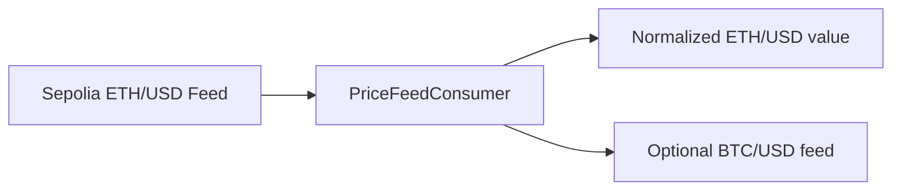

# Track 1 — Price Feed Consumer

## Goal

Read the ETH/USD price from Chainlink Data Feeds and understand the oracle problem.

## What students learn

- what an oracle is
- why smart contracts need external data
- how `AggregatorV3Interface` works
- how to read and normalize price feed data

## Estimated completion time

45 to 60 minutes

## Difficulty

Beginner

## Architecture



## Files in this track

- `contracts/track1/PriceFeedConsumer.sol`
- `scripts/track1/deploy-price-feed.ts`
- `resources/architecture-diagrams/track-1-price-feed.mmd`

## Copy-paste commands

```bash
npm install
cp .env.example .env
npm run compile
TRACK=track-1 npx hardhat run scripts/deploy.ts --network sepolia
```

## Expected output

- deployed consumer contract address
- readable price output from the feed
- optional BTC/USD comparison if the extra feed is configured

## Bonus challenge

Add the BTC/USD feed and compare ETH versus BTC in the same contract.
