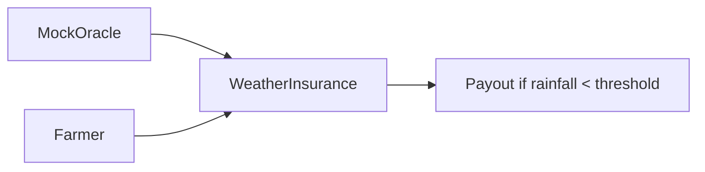

# Track 2 — Weather Insurance

## Goal

Build a simplified parametric insurance contract for a farmer.

## What students learn

- what a mock oracle is
- how insurance logic works onchain
- how a payout rule can be triggered by data

## Estimated completion time

60 to 75 minutes

## Difficulty

Beginner to intermediate

## Architecture



## Files in this track

- `contracts/track2/MockOracle.sol`
- `contracts/track2/WeatherInsurance.sol`
- `scripts/track2/deploy-weather-insurance.ts`
- `resources/architecture-diagrams/track-2-weather-insurance.mmd`

## Copy-paste commands

```bash
npm install
cp .env.example .env
npm run compile
TRACK=track-2 npx hardhat run scripts/deploy.ts --network sepolia
```

## Expected output

- a mock oracle contract
- an insurance contract funded with a payout reserve
- a working premium and payout flow

## Bonus challenge

Add a richer premium model or a second rainfall threshold for partial payouts.
