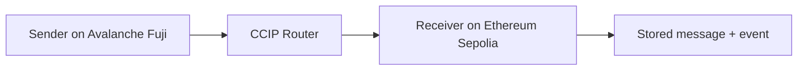

# Track 3 — CCIP

## Goal

Send a text message from one chain to another using Chainlink CCIP.

## What students learn

- cross-chain messaging
- router-based architecture
- source chain versus destination chain
- how a receiver validates the sender

## Estimated completion time

75 to 90 minutes

## Difficulty

Intermediate

## Architecture



## Files in this track

- `contracts/track3/CcipSender.sol`
- `contracts/track3/CcipReceiver.sol`
- `contracts/shared/ccip/Client.sol`
- `contracts/shared/ccip/IRouterClient.sol`
- `contracts/shared/ccip/CCIPReceiver.sol`
- `scripts/track3/deploy-ccip.ts`
- `scripts/track3/send-ccip-message.ts`
- `resources/architecture-diagrams/track-3-ccip.mmd`

## Copy-paste commands

```bash
npm install
cp .env.example .env
npm run compile

# 1) Deploy the receiver on Sepolia
TRACK=track-3 npx hardhat run scripts/deploy.ts --network sepolia

# 2) Put the receiver address into CCIP_RECEIVER_ADDRESS, then deploy the sender on Avalanche Fuji
TRACK=track-3 npx hardhat run scripts/deploy.ts --network avalancheFuji

# 3) Send the message
CCIP_SENDER_ADDRESS=0xYourSenderAddress npx hardhat run scripts/track3/send-ccip-message.ts --network avalancheFuji
```

## Expected output

- a sender contract on Avalanche Fuji
- a receiver contract on Sepolia
- a message stored in the receiver contract

## Troubleshooting

- Confirm the router address.
- Confirm the source and destination chain selectors.
- Confirm the sender and receiver are on the correct networks.

## Bonus challenge

Send a second payload field such as a timestamp or a student name.
