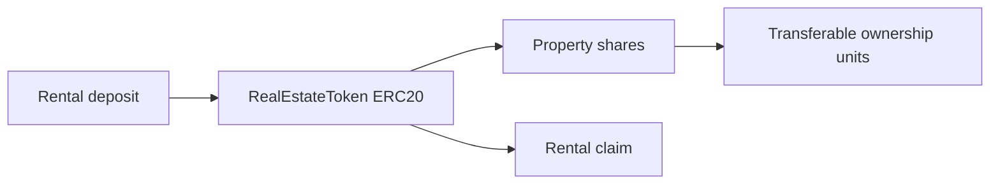

# Track 4 — Tokenization

## Goal

Create a tokenized real-estate example using ERC20.

## What students learn

- what tokenization means
- how ERC20 represents ownership units
- how real-world value can be modeled onchain

## Estimated completion time

45 to 60 minutes

## Difficulty

Beginner

## Architecture



## Files in this track

- `contracts/track4/RealEstateToken.sol`
- `scripts/track4/deploy-tokenization.ts`
- `resources/architecture-diagrams/track-4-tokenization.mmd`

## Copy-paste commands

```bash
npm install
cp .env.example .env
npm run compile
TRACK=track-4 npx hardhat run scripts/deploy.ts --network sepolia
```

## Expected output

- an ERC20 share token
- a treasury address holding the initial supply
- an optional rental distribution simulation

## Bonus challenge

Add a rental payout demo for token holders.
